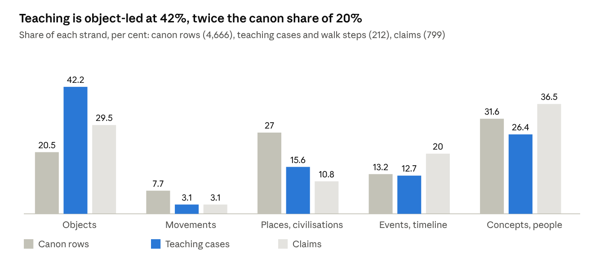
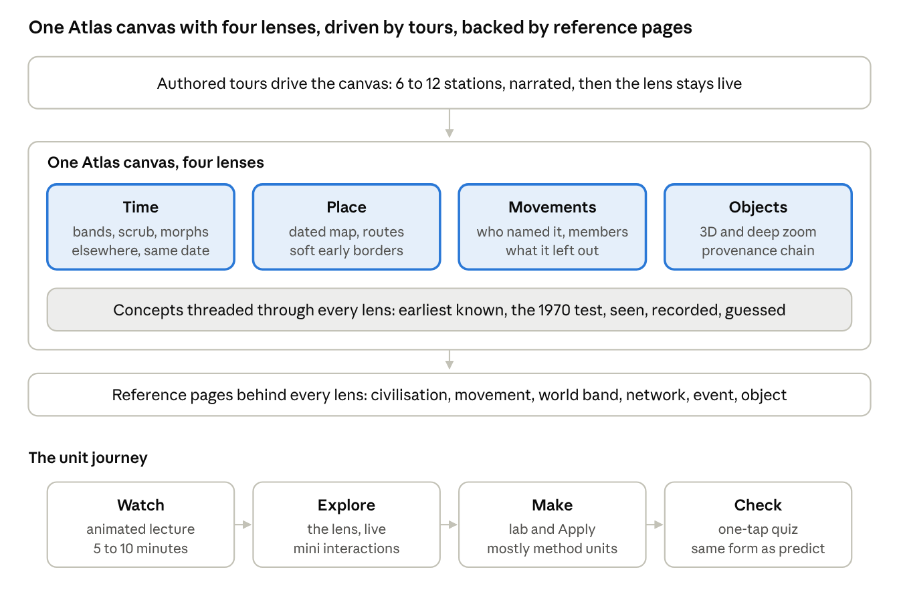

# F1 Content Audit — strands, method and Atlas

2026-10-03 · @Mohammad AlFalasi

F1 has deep, checked object content and thin content on movements, civilisations in time and place, events and the world timeline; its unit method still asks learners to reconstruct before they have seen. This audit counts what we have, critiques it, benchmarks atlases, games and programmes, and proposes one Atlas with four lenses built dense.

## 1. What we have, in numbers

The canon is broad; the teaching is narrow. Across five strands, the canon's 4,666 rows lean towards places, polities and people, while the 212 cases and walk steps in the 38 unit specs lean towards objects.

*counted 3 October 2026 from the repository: canon CSVs, the 38 unit specs (cases hand-classified; claims by keyword, ±5–8 points)*

Objects are 20% of the canon but 42% of what the units teach. Movements are the thinnest strand in both: 7.7% of the canon (361 rows: 180 styles, 106 movements, 47 schools, plus round-3 additions) and 3.1% of cases, and 4.5 of those 6.5 case-weights sit in two units, F1.19b and F1.20. Across the eleven world chapters the only movement content is half a step on the Hawaiian Renaissance (F1.12) and half a step on the Mamluk revival (F1.10). Civilisations and places are 27% of the canon and 36% of its top tier, but 15.6% of cases, and in the world chapters the polity is usually the setting of an object step (Kush behind a lamp, Goryeo behind a bowl, Wari behind a tunic) rather than the thing taught. Only F1.13 teaches networks as networks.

| Strand | Canon rows | Cases (of 212) | Open objects, claims | Built pages |
|---|---|---|---|---|
| Objects, materials, techniques | 955 | 89 | 374 register objects; 236 claims | 38 unit specs, every one opening on an object or a record |
| Movements, styles, schools | 361 | 6.5 | 25 claims | 2 grouping pages (Mingei is in the Atlas doc; Arts and Crafts) |
| Civilisations, polities, cultures, places, networks | 1,260 | 33 | 86 claims | 3 grouping pages (Indus, Middle Horizon, Indian Ocean); the waqf page |
| Events, periods, the world timeline | 616 | 27 | 160 claims | none; F1.5 is the one unit on simultaneity |
| Concepts, people, communities, institutions, practices | 1,474 | 56 | 292 claims | the glossary; the Historian pack |

The Atlas doc promised about 60 Ring-1 grouping pages with walks. Five exist. Of the 18 presentation forms in the Final Structure, the specs use the prediction prompt most (form 15, in 14 of 38 units), then the comparison wall (10), the argument card, the object story and the map (8 each). Scrollytelling appears in 4 units, the timeline scrub in 4, and the 3D turntable, the animated diagram and short video in none. The Lab, Apply and Partner rows ask the learner to write, tag, sort or fill in 102 places, and to guess or predict in 28.

## 2. Critique 1: the module is object-heavy, and the pipeline made it so

Your instinct is right, and the cause is structural rather than a matter of taste. Three decisions, each sound on its own, pushed every unit towards objects.

1. **The open-licence rule and the harvest.** The only things we can harvest at zero cost with a licence we can read are museum records: CC0 images with a holder, an accession number, a date range and a provenance chain. Movements, civilisations and events have no holder, no licence field and no API, so the pipeline could not pull them in. The canon got them by hand (361 movement rows, 1,260 place and polity rows), but nothing downstream, no harvest, no fact-check gate, no open-object table, was built for them. What the pipeline could verify became what the units teach.
2. **The template's opening moves.** Fourteen of 38 units open "object first", "artifact first" or "lab first" on a single record, and the template's cases are "object stories" (form 3). A world chapter is a string of nine to twelve object steps, with the polity, the movement and the date as captions. The *Histories of making* school this follows, MacGregor's hundred objects and Smarthistory's close looking, is one legitimate way to teach the history of making. It is a method, not the whole subject, and we let the method set the syllabus.
3. **The Historian's rules.** "Earliest known", named hands, the 1970 test and the provenance chain are object rules. They are good rules, and they gave the module its rigour. They have no equivalent for a movement (who named it, who was in it, what it was against, what it left out) or for a civilisation (its span, its places, what the name hides), so those strands never got their own discipline and so never got written.

**What each strand gets now**

| Strand | What exists | What is missing for a dense build |
|---|---|---|
| Creative-industries movements (art, design, craft, media) | 361 canon rows; two grouping pages; the Bauhaus, Vkhutemas, Ulm, Mingei, Arts and Crafts and the colonial art schools taught in F1.19b and F1.20 | A movement page type with its own rules; the whole European line from Gothic lodges to Postmodernism outside Bauhaus to Ulm; Art Nouveau, Werkbund, Art Deco, Scandinavian and Italian modern; Japanese and Korean postwar design; Papunya Tula and desert painting; Mexican muralism; Afrofuturist and contemporary African design; the media, fashion, games and advertising movements the word "creative industries" implies, which the canon barely has |
| Civilisations, places, networks | 1,260 canon rows; three grouping pages; F1.13 on networks; civilisations as the setting of object steps everywhere else | A civilisation page type with span, extent on a dated map, what the name hides, and its making; the absences in section 10 (Ife, Classic Maya, Teotihuacan, Gothic Europe, Sasanian Iran, Angkor, Cahokia, al-Andalus) |
| Objects and concepts | 374 register objects; 955 object, material and technique rows; the glossary; the method units F1.25 to F1.31 | Enough objects already. Concepts are strong as method (seen, recorded, guessed; the 1970 test) and weak as content: there is no concept layer that a learner can browse, only glossary entries |
| The world timeline | 616 event and period rows; eleven coverage bands; F1.5 on recurrences; "what was happening elsewhere" as a panel in one lab | No built timeline with content in it: no world-state card per band, no simultaneity view in any world chapter, no animated story of how making moved. The bands exist for counting coverage, not for teaching |

**What this is not.** It is not a case for fewer objects. The 374 open objects are the module's evidence, and every benchmark that works (section 6) keeps a dense object layer under its stories. It is a case for three more page types, movement, civilisation and world-band, with the same rigour the object got, and for units whose walk can step through a movement or a century, not only through a record.

## 3. Critique 2: the unit method, and "guess, then find out"

The method is not unsettled on paper. The Final Structure already has what you are asking for: a catalogue of 18 presentation forms in which scrollytelling and parallax pages are the default for narrative (form 1), the timeline scrub (11), the map (12), the 3D turntable (9) and the animated diagram (6) are named, and every unit must ship a five-minute, a session and a reference form. It is unsettled in the specs, which took the forms that are cheap to specify (a prediction prompt, a comparison wall, an argument card) and left the expensive ones as names. No spec has a storyboard, a shot list, a narration script or an asset plan for an animated explanation.

**Where "guess, then find out" sits.** It appears in three places, and they are not equally wrong.

| Where | What the learner does | Verdict |
|---|---|---|
| The opening move (form 15; 14 units) | Reads a claim, a counter-claim and a case, answers a question, then sees the reveal | Keep, in a different form: one tap on a map, a timeline or three plausible options, with the answer shown within seconds. Never typed |
| The labs that reconstruct before showing (the Object Autopsy's five guessed layers; the operational-sequence ordering; the crisis ledger's five columns) | Guesses or orders, then sees the record | Cut as a gate. The evidence below argues against unassisted "work it out" labs for novices. Keep the reveal, drop the obligation to guess first, keep the ordering strip as an optional one-drag puzzle after the explanation |
| The Apply and Partner steps (102 asks to write, tag, sort or fill) | Writes sentences, tags each seen, recorded or guessed, fills columns | Keep for the method units (F1.25 to F1.31), where tagging *is* the skill. Remove from the world chapters, where it is homework attached to a lecture that has not yet happened |

**What the research says.** Six source sets were opened for this audit (section 12).

- Unassisted discovery loses to explicit instruction (Alfieri et al. 2011, 164 studies, d = −0.38), and discovery with feedback, worked examples or scaffolding wins (d = +0.30). The line is not active against passive; it is supported against unsupported. Our reconstruction labs are on the wrong side of it.
- Pretesting works, for a specific stated fact, when the learner commits with one choice, the answer follows at once and the prompt targets the segment that follows (Richland, Kornell and Kao 2009; Pan and Carpenter 2023, with an 8 to 9 point exam gain in a real course). Multiple choice with plausible wrong options spreads the benefit to related content (Little and Bjork 2016); typed answers do not. Conceptual pretests ("why did it happen?") did not improve understanding.
- Prediction works through surprise, and only when made before the reveal (Brod 2021; Brod et al. 2022).
- Learners under-rate pretesting even when it helps them (Huelser and Metcalfe 2012). Your worry that people will not want to guess is real as a perception. It is not evidence that a one-tap prediction fails; it is evidence that a typed one will be abandoned.
- For animation, segmenting and signalling carry the largest effects (Mayer 2024; Noetel et al. 2021 across 29 meta-analyses). Animation's measured advantage is on mechanisms and transfer, not on facts (Cromley and Chen 2025). So a 2.5D animated lecture earns its cost where something moves, a route, a border, a loom, a kiln, and a labelled still does the rest.
- A short retrieval quiz after a segment is the surest gain of all (Yang et al. 2021, g = 0.50; multiple choice is not a lesser form of it).

**The method that follows.** Watch first, then explore, then make. Each unit becomes a tour of 6 to 12 stations over a map, a timeline or an object, one idea and one visual per station, 100 to 200 words or 60 to 90 seconds of narration; an optional one-tap prediction before a station and one retrieval question after it, in the same tap form; the Atlas lens stays live when the tour ends; the lab and the Apply follow the tour and are kept for the method units. Across the 58 benchmarks opened for this audit, "guess, then type" appears in none of them. Smarthistory's pinned guiding questions ask for reflection, Brilliant takes a tap or a drag, Discovery Tour closes a tour with a quiz, and nobody at scale asks a solo learner to predict in prose.

## 4. Critique 3: how the Atlas is structured now

The Atlas logic (nodes, groupings, relations, five surfaces, lenses and stories) is sound and holds up against the 21 atlases benchmarked in section 5. Its three weaknesses are about what was built and how time is handled, not about the model.

1. **It is a database with views, not yet a place to learn.** Place, Time, Connections, Compare and the grouping pages are layouts of the same 4,666 nodes. What makes the benchmarks teach is a layer the Atlas names but has not built: the authored tour that drives the canvas (ChronoZoom's guided tours, Chronas's autoplay with a drawer, Discovery Tour's stations) and then hands it to the learner. Our "Story" is defined as a walk of 6 to 9 steps that lights up members on a small map. That is the right idea at a tenth of the size it needs: no narration, no motion, no camera.
2. **Time is a counting device, not a teaching one.** The eleven bands (B01 before 8000 BCE to B11 1900 to now) exist so the coverage grid can count nodes per cell. Nothing is written for a band: no world-state card, no "who was making what" at 1000 CE, no morph from one snapshot to the next. The Met's Timeline, TimeMaps and the Histomap all work because every cell of a region-by-period grid has dense authored content and sideways links to "elsewhere at this date". We have the grid and 99 empty cells (nine world chapters by eleven bands).
3. **Uncertainty is modelled and not shown.** The register carries date ranges, provenance tests and confidence words, and the canon carries "earliest known" and contested fields. The Atlas design renders none of it: pins are pins, bands are bands. PeriodO draws fuzzy period ends; the World Historical Gazetteer carries a certainty per attestation; Running Reality asserts "exists at" from a dated source and interpolates. Every scrub viewer that ignores this (Chronas, OpenHistoricalMap tiles, the "every year" videos) ends up drawing hard borders for the Bronze Age, which is exactly the false confidence the Historian's rules forbid in text.

**Smaller points.** The grouping page is the right page type for movements and civilisations, and it is the lever: five exist against about 60 promised, and most walks already name the object a missing page would open from. The Connections surface has no network pages behind it, so routes are drawn but never taught except in F1.13. The Compare surface is a desk-only tool that no unit yet uses. The phone plan (Place, Time, grouping pages, Story) is right and should stay. The one-lens-at-a-time and seven-colour rules are right. The "first known" mode of Time is a trap unless it is renamed "earliest known" and draws a range, not a point.

**What the Atlas should become.** One canvas, four lenses (time, place, movements, objects) with concepts threaded through all four, driven by authored tours that end with the lens live. Section 8 draws it.

## 5. Benchmarks: atlases, timelines and maps

Twenty-one were opened on 3 October. They fall into three families, and no product combines all three. **Snapshot grids** (the Met, TimeMaps, Smarthistory) fix a few period bands, cross them with regions, and write every cell densely. **Time-scrub viewers** (Chronas, Running Reality, OpenHistoricalMap, Histography, ChronoZoom) are data-driven, visually strong and text-poor, resolve time to the year and so draw hard borders where none are known, and outsource their narrative to Wikipedia or a tour. **Backbones** (Getty, PeriodO, Wikidata, Pleiades, the World Historical Gazetteer, Seshat) are where the field models movements, periods, places and uncertainty, under open licences, and render almost nothing.

| Benchmark | How it is structured | What the user does | Borrow | Avoid | Licence |
|---|---|---|---|---|---|
| [Heilbrunn Timeline of Art History](https://www.metmuseum.org/toah/) (Met, 2000–) | About 1,000 essays × 8,000 works × 291 chronologies × 3,700 keywords. Chronologies are a grid of about 40 regions × 10 period bands; each cell has a map, an overview, sub-region phase bands, key events and up to 10 works | Picks a region or period, reads, jumps sideways by keyword. No scrub, no animation, no quiz | The region × period grid as the spine; the keyword lattice that links movements, works, places and periods; key events per cell | Static pages; Met-centric | Copyright |
| [Chronas](https://chronas.org/history) (2015; rebuilt 2026) | Province × year → ruler, culture, religion; markers; "Epics" (curated article sets) over one map | Drags a year slider or presses autoplay (speed, reverse); clicks a province for a drawer with tabs; follows an Epic | Autoplay as the engine of an animated lecture; the entity drawer with tabs; story layers over one map; deep links | Hard borders per year; Wikipedia as the only text | 2015 code MIT; v2 repos unlicensed |
| [Running Reality](https://runningreality.com/) (c. 2010–) | Every object (nation, city, road, person) has its own timeline; dated "factoids" with citations alter it and the engine interpolates; branchable alternate timelines | Drags to any day 3000 BCE to now, down to street level; clicks an object for its events | The "exists at" factoid: assert existence on a dated source, let the engine interpolate; branches for disputed histories | Closed, watermarked data; no reuse | Free to use; non-commercial |
| [OpenHistoricalMap](https://www.openhistoricalmap.org/) (2012–) | OSM data model with start and end dates on every feature, EDTF for uncertain dates, a source on each feature; vector tiles filterable by date | Sets a range, drags or animates; queries "what surrounded this point at this date" | The CC0 time-aware basemap for our Place lens, with [maplibre-gl-dates](https://github.com/OpenHistoricalMap/maplibre-gl-dates/) | Uneven coverage; tiles collapse uncertainty to one date | Data CC0; plugin CC0 |
| [TimeMaps](https://timemaps.com/) (c. 2011–) | 20 key dates × 3 levels (world, nine regions, countries); each map page has pins, a text panel, civilisation bands and "what else is happening" links | Clicks a date, drills down, jumps sideways at the same date | The fixed key-date lattice with up, down and sideways navigation; civilisation bands under the map | Snapshot gaps between dates | Free core, ads; Premium closed |
| [Histography](https://histography.io/) (2015) | 15,000 Wikipedia events as dots on one exponential time scale | Resizes the span; hovers and clicks dots | The exponential slider; dots that re-lay out with animation | Events without story or place; unmaintained | Events CC BY-SA |
| [ChronoZoom](http://www.chronozoom.com) (2010–14, retired) | Nested timelines on an infinite-zoom canvas; exhibits; **guided tours** that zoom from cosmos to a day | Zooms; plays a tour; authors tours | Tours over a zoomable canvas: an animated lecture that ends with the canvas live | Dead stack; no map | Apache 2.0 code |
| [World Historical Gazetteer](https://www.whgazetteer.org/) and [Pleiades](https://pleiades.stoa.org/) | Place → attestations with names, geometry, time span and a certainty 0–1 (WHG); places, locations, names and dated connections (Pleiades) | Searches with time filters; plays a collection's sequence; downloads | Attestation with certainty and earliest/latest bounds; period tags on every claim | WHG is a licence patchwork (43% share-alike, some non-commercial) | WHG mixed; Pleiades CC BY |
| [ORBIS](https://orbis.stanford.edu/) (Stanford, 2012) | A network of about 1,600 Roman route segments with speeds and costs by month and mode | Picks two places, a month and a mode; reads the route and its cost; draws a cost cartogram | The mini-interaction on a map: a few controls, one visible, arguable result | One period only | Free; licence unstated |
| [Google Arts & Culture Explore](https://artsandculture.google.com/explore) | Browse by 128 movements, medium, place; a Time Explorer band of unequal eras along which works stream | Drags the era band; picks a colour; follows stories | Era bands of unequal width that compress deep time; works streaming along time | Partner-rights images; no civilisation narrative | Proprietary |
| [Smarthistory, Reframing Art History](https://smarthistory.org/reframing-art-history/) | Six chronological parts × 79 chapters; each chapter is up to 20 curated essays and videos with two to four pinned guiding questions | Reads, watches, picks chapters in any order | The chapter as a curated story over a shared pool of items (our stories over the Atlas); pinned reflective questions | Text first; no map | CC BY-NC-SA |
| [Wikidata P135](https://www.wikidata.org/wiki/Property:P135) and Wikipedia period lists | Art movements as items with inception, end, country and influence links; works and people attach by P135; a SPARQL timeline view | Queries | The movement backbone: ids, spans, countries, influence links, and the join to our objects and makers | Western weighting; inconsistent dates | Wikidata CC0; text CC BY-SA |
| [Getty AAT, TGN, ULAN](https://www.getty.edu/research/tools/vocabularies/obtain/download.html) | Thesauri for styles and periods, places with coordinates and historical names, and makers | Reconciles; queries SPARQL | Canonical ids for movements, materials, techniques, places and makers | XML releases ended 30 January 2026; linked data only | ODC-By 1.0 |
| [PeriodO](https://perio.do/en/) | Each entry is one authority's definition of a period, with earliest and latest bounds on both ends, a quoted source and linked places; several definitions of one period side by side | Browses by time; adds an authority | Fuzzy period bars; competing definitions of "Renaissance" or "Edo" shown together | Spatial coverage often empty | CC0 |
| [Seshat](https://seshat-db.com/terms/current/) | Polities bounded in space and time; variables coded present, inferred or unknown with disagreement noted and a paragraph of justification | Browses polities; downloads | The coding of uncertainty, and a sourced paragraph behind every code | Social-complexity focus | CC BY-SA 4.0 on the current terms |
| [OldMapsOnline](https://www.oldmapsonline.org/en/maps/about-oldmapsonline) | 70,000 georeferenced scans indexed by footprint and year | Pans; drags a year slider; overlays a scan with transparency | The overlay as a then-and-now micro-interaction | A finder, not an atlas | Scan rights vary |
| [Vitra Design Museum collection](https://collection.design-museum.de/en/) | Six epochs × objects × designers × manufacturers; no interactive timeline online | Searches, reads biographies | Manufacturer histories and designer biographies as node pages, which we lack | Object-only drill-down with no movement or place pages: our own imbalance | Copyright |
| "History of the World: Every Year" (YouTube, 2016) and the Histomap (1931) | One frame per year with polities as coloured regions; a one-sheet streamgraph of "relative power" | Watches; reads top to bottom | The appetite for watching borders move, as the opening beat of a civilisation lecture; the row-wise "same date across all peoples" reading | Hard borders for pre-literate eras; the Histomap's undefined power axis; neither is reusable | Standard YouTube licence; scan CC BY-NC-SA |

**Adopt first.** An open backbone before more content: Wikidata movements keyed to Getty AAT ids, PeriodO bounds, TGN and Pleiades places, OpenHistoricalMap tiles. A key-date lattice as the world-timeline spine, every cell dense, with "elsewhere at this date" links; animated lectures then morph between snapshots rather than needing per-year data nobody can source. Authored tours and free scrubbing on one canvas, with our own text in the drawer. Uncertainty drawn, not hidden: fuzzy period ends, soft early borders, "attested at" markers for objects and workshops.

## 6. Benchmarks: games, 3D objects and interactives

Twenty-one were opened. Every strong one has the same skeleton: a macro-structure that is spatial (a map, a timeline, a room, an object) and a micro-structure that is a paced sequence of stops. Density is handled by chunking, not by cutting: about 2,000 narrated words per Discovery tour, 2,000 to 3,000 words per *Snow Fall* chapter, 60 to 120 words per *80 Days* beat, a paragraph per Voyager tour step, with the reader setting the pace. A reference layer sits behind the story layer in all of them, and the one game that dropped it for role-play (Discovery Tour: Viking Age) got thinner.

| Benchmark | What it is | What the user does | Borrow | Avoid | Licence |
|---|---|---|---|---|---|
| [Discovery Tour: Ancient Egypt](https://news.ubisoft.com/en-us/article/46PlC3yAeikjDI652TayLm/assassins-creed-origins-discovery-tour-qa-with-historian-maxime-durand) (Ubisoft, 2018) and Ancient Greece (2019) | 75 narrated tours of about 2,000 words each, over a world built with historians; Greece adds 30 themed tours with an end-of-tour quiz and "Discovery Sites" | Walks a marked route; stops at stations; takes a quiz | The station tour as the unit form; the end-of-tour quiz; curated images in a side panel | The commercial engine | Commercial |
| [Discovery Tour: Viking Age](https://www.pcgamesn.com/assassins-creed-valhalla/discovery-tour-review-viking-age) (2021) | Eight character quests with dialogue choices and a codex | Plays quests | Nothing new | Trading density for agency: reviewers found it thinner | Commercial |
| [Civilization VI Civilopedia](https://www.civilopedia.net/en-US/gathering-storm/civilizations/civilization_china/) | Every entity in the game has a page: a facts block, a hyperlinked historical essay of up to 2,500 words, related entries | Clicks anything to read about it | A reference page for every civilisation, movement, place and event, with a facts block and links | Unpaced, unillustrated essays | Copyright |
| [Humankind encyclopedia](https://humankind-encyclopedia.games2gether.com/en-us/fame-cultures/game-content/cultures) | Era × culture matrix: six eras, ten cultures each | Browses by era then culture | The era × culture matrix as a timeline navigation | Short blurbs | Free to read |
| Minecraft Education history lessons | Built worlds with NPCs and reading boards; a three-week Egypt unit | Explores and builds | Little for us | Proprietary worlds; per-user cost | Paid |
| *80 Days* (inkle, 2014) and *Pentiment* (Obsidian, 2022) | 500,000 words of branching prose paced in 60 to 120-word beats over a globe; a 16th-century scriptorium with a tap-to-open glossary on every underlined term | Taps to choose; taps terms | Short beats; the inline glossary term | Fiction's licence with facts | Commercial |
| [Smithsonian Voyager](https://smithsonian.github.io/dpo-voyager/story/usage/tours-task/) and [Open Access 3D](https://3d.si.edu/open-source-resources) | An open-source 3D viewer with annotations, articles and authored step-through tours; 2,000+ CC0 models | Orbits and zooms; follows a tour step by step | The authored object tour over a 3D model; self-hosting | Nothing | Apache 2.0; models CC0 |
| [Sketchfab](https://sketchfab.com/3d-models/the-rosetta-stone-1e03509704a3490e99a173e53b93e282) (British Museum account) | Orbit with numbered annotations | Orbits; taps hotspots | The numbered hotspot tour | Sold to KitBash on 10 August 2026; many museum models are CC BY-NC-SA, so ineligible for us; self-host what is CC0 or CC BY now | Free tier; models vary |
| [model-viewer](https://modelviewer.dev/examples/annotations/) (Google) | One HTML tag shows a glTF model with orbit, hotspots and AR | Orbits; taps | The fastest path to "3D object interaction" | Nothing | Apache 2.0 |
| [Ciechanowski's explainers](https://ciechanow.ski/mechanical-watch/) | Thousands of words with dozens of drag-and-scrub 3D demonstrations, one per idea | Drags to rotate; scrubs a slider; reads | The scrub slider that shows a mechanism: a loom, a press, a kiln, lost-wax casting | Hand-built per page; no reuse licence | Free to read |
| [Explorable Explanations](https://explorabl.es/) (Nicky Case and others) | Prose with tiny simulations the reader plays; *Trust* is 3,300 words and CC0 | Plays; taps to continue | The explorable for a concept with a variable (a tolerance, a trade cost) | Nothing | Many CC0 |
| [Brilliant](https://blog.brilliant.org/hand-crafted-machine-made/) | One idea per screen; tap, drag or choose; instant feedback; a maths keyboard for numbers, never prose | Taps and drags | One beat per screen; feedback within a second | Subscription | Paid |
| [*Snow Fall*](https://source.opennews.org/articles/how-we-made-snow-fall/) (NYT, 2012), [The Pudding](https://pudding.cool/) and [*The Boat*](https://www.sbs.com.au/theboat/) (SBS, 2015) | Scroll-driven chapters with media triggered in flow; 300 drawings in parallax panels with sound | Scrolls; the page animates | The 2.5D scroll chapter grammar for an event, a movement or a civilisation; chapter breaks; auto-scroll as an option | Copyright | Free to read |
| [Google Arts & Culture Art Camera and Pocket Gallery](https://artsandculture.google.com/project/pocket-gallery) | Deep zoom to the brushstroke; 3D rooms with an audio tour | Zooms; walks | Deep zoom with an audio guide | Partner-owned images | Proprietary |
| [IIIF and OpenSeadragon](https://iiif.io/get-started/how-iiif-works/) | A standard for tiled images with annotations; an open viewer | Pans and zooms | Deep zoom for every CC0 image we hold, with annotations | Nothing | Open |
| [A History of the World in 100 Objects](https://www.bbc.co.uk/ahistoryoftheworld/about/) (BBC and the British Museum, 2010) | 100 objects, each a 15-minute programme; thousands of objects filtered by time, place, material and theme | Filters; listens | The filter set across the Atlas: culture, material, time, theme, place | The Flash explorer is defunct | BBC archive |

**What this says for us.** The interaction models that suit a dense visual programme are scrub, tap and step: drag to rotate, slide to reveal, tap a hotspot, tap to choose, scroll to reveal, step through a tour. None of the 21 asks the learner to type a guess. Three things to adopt first: the station tour as the unit form, with one-tap predictions and a closing quiz; the open object stack now (Voyager for authored tours, model-viewer for light hotspot views, IIIF deep zoom), with CC0 and CC BY models downloaded and self-hosted before Sketchfab's new owner changes the terms; and a reference page for every civilisation, movement, place and event, which is the Civilopedia's lesson and the fix for the thin strands.

## 7. Benchmarks: online programmes and animated lectures

Sixteen were opened. Every programme that stays dense without exhausting the learner separates a reference layer from a narrative layer and links them on one page. The universal lesson grammar is several short visual items rather than one long film: MoMA's modules are seven videos of two to five minutes plus six question-titled readings; TED-Ed is one five-minute film and a "dig deeper" tier; the Open University's "Design in a nutshell" is six movement animations of three to eight minutes that have stood for a decade. Typed answers appear only where a teacher or cohort exists.

| Programme | How a lesson is built | What the learner does | Borrow | Licence |
|---|---|---|---|---|
| [Smarthistory](https://smarthistory.org/about/) (2005–; 3,500 essays and videos) | One page contract: video (5 to 16 min, two voices) → time-stamped transcript → essay of 1,500 to 3,000 words → a faceted record (place, period, culture, style, material, technique) → bibliography → explore related | Watches, reads, follows links; no quiz on the site | The page contract, and the faceted record wired to the Atlas | CC BY-NC-SA 4.0 |
| [Khan Academy art history](https://www.khanacademy.org/humanities/art-history) | Smarthistory's content in units with multiple-choice checks | Watches; answers | The multiple-choice check after a segment | CC BY-NC-SA |
| [MoMA, Modern Art & Ideas](https://www.coursera.org/learn/modern-art-ideas) (Coursera) | Six thematic modules, about seven hours: seven videos of two to five minutes plus readings framed as questions and a peer assignment | Watches short videos; writes for peers | Theme-led modules that mix objects, people and places under one idea; the two-to-four-minute single-work video | Copyright |
| [OER Project, Big History and World History](https://www.oerproject.com/Big-History) | Every lesson is a step sequence: opener with no typing → video with before, while and after look-for questions → article read in three passes → a short claim; four start dates for World History | Watches with look-fors, reads in passes | The lesson spine; "three close reads"; scale-switching between the cosmic and the local | CC BY-NC |
| [HarvardX, Pyramids of Giza](https://giza.fas.harvard.edu/) with Digital Giza | Lectures over a 3D model of the plateau with every excavation record linked | Walks the model; reads records | A site model with the archive behind it | Giza 3D terms not opened |
| [Open Yale, Roman Architecture](https://oyc.yale.edu/history-of-art/hsar-252) | 23 lectures of 75 minutes over 1,500 images | Watches | A dense lecture series as the reference tier, not the first contact | CC BY-NC-SA |
| [Google Arts & Culture stories and entities](https://artsandculture.google.com/story/bauhaus-the-school-of-modernism/8QUh8UW9Rfa-Kw?hl=en) | A story is 15 to 40 slides, one image and 50 to 150 words each; an entity page ("Bauhaus style, 1919–1938") is an auto-built record with a date range and every linked item | Scrolls; taps to zoom | The entity page for every movement and civilisation, with span, extent and linked objects | Proprietary |
| [OpenLearn, Design in a nutshell](https://www.open.edu/openlearn/science-maths-technology/engineering-and-technology/design-and-innovation/design/design-nutshell) | Six movement animations of three to eight minutes with transcripts: Gothic Revival, Arts and Crafts, Bauhaus, Modernism, American industrial design, Postmodernism; courses with self-assessment whose answers are an optional reveal | Watches; does a hands-on activity; reveals answers | The movement animation as a form, and the optional reveal that never blocks | CC BY-NC-SA |
| [TED-Ed](https://ed.ted.com/blog/2022/06/28/how-ted-ed-partnerships-work) | Watch (five minutes; an 800 to 900-word script, 10 to 20 edits, a fact-check, four months) → Think (five multiple-choice, three open) → Dig deeper → Discuss | Watches; answers | The script length; the fact-check in the credits | Copyright |
| [Kurzgesagt](https://www.youtube.com/watch?v=uFk0mgljtns) | A nine-minute flat-vector film in 1,200 hours, with a published source sheet of 15 to 30 pages | Watches | The source sheet, not the production budget | Copyright |
| [Crash Course World History and Art History](https://thecrashcourse.com/courses/crash-course-art-history-preview/) | Twelve minutes: host, a two-minute animated "thought bubble", a wrap; Art History has 22 episodes (2024) | Watches | The chaptered episode with one animated segment | Copyright |
| [Extra History](https://www.extracredits.site/) | Four to six episodes of 9 to 15 minutes per topic, then a "Lies" episode correcting the simplifications | Watches | The "what we simplified" note | Copyright |
| [Historia Civilis](https://www.historiacivilis.com/) | One narrator, one flat map, coloured shapes and a legend; episodes of 3 to 27 minutes | Watches | The zero-studio visual system: shapes on a map with a legend | Copyright |
| Design Museum and V&A Academy; Domestika, CalArts, LinkedIn | Paid short courses; 17 to 20 lessons of 5 to 20 minutes with downloads | Watches; makes | Lesson length only | Paid |

**What to adopt first.** A page contract for every unit: a 5 to 10-minute animated lecture, a time-stamped transcript, a dense essay, the faceted record wired to the Atlas, a sources sheet and "explore related". An entity page for every movement, civilisation and event, in the Google Arts & Culture shape, with a date span, a map extent and linked objects, which is how the thin strands grow without new objects. OER Project's lesson spine in place of "guess, then find out": opener without typing, watch with look-fors, read in passes, a multiple-choice check, a closer that shows the answer on the map or timeline, with typed reflection optional and never a gate. A movement and civilisation lecture series in the Historia Civilis and OpenLearn style, three to eight minutes each. And a sources-and-simplifications tier on every unit, so lectures can stay short and still be trusted.

**One warning.** Every open programme here (Smarthistory, Khan, OER Project, Open Yale, OpenLearn) is a non-commercial Creative Commons variant. They are fine to learn from and to link to. Nothing derived from them can go into F1 if F1 is ever sold.

## 8. Proposal: one Atlas, four lenses, and the unit journey

You said the timeline, the civilisations, the movements and the objects feel connected but may each need a different treatment, or different views on one Atlas. Both are true, and the benchmarks settle how: one canvas, four lenses, each lens with its own native motion, and authored tours that drive the canvas and then hand it over.

*the proposed structure · one canvas, four lenses, a concept thread, a reference layer, and the four-step unit journey*

A tour is an animated lecture that moves the canvas; when it ends, the lens it was on stays live, and every reference page is one tap away.

**The four lenses and their native motion**

| Lens | What it shows | Its motion | Mini interactions | What it needs written |
|---|---|---|---|---|
| Time | The world timeline: eleven bands × nine world chapters, each cell a dense world-state card; movements as fuzzy bars; objects and events as attested marks; "elsewhere at this date" across the row | Morphs between adjacent snapshots (TimeMaps, Chronas autoplay); an exponential scrub (Histography); competing period definitions side by side (PeriodO) | Drag the scrub; tap a band for its card; tap a bar for its movement page; a one-tap "when was this made?" on a timeline before a reveal | 99 band cards; period bounds from PeriodO; the recurrences of F1.5 as rows |
| Place | A dated map on OpenHistoricalMap tiles: polities with soft early borders, sites, workshops, routes as animated arcs (deck.gl), materials as flows, people as people with a note, never as goods | The camera flies between stations; routes draw themselves; a scrub redraws borders | Tap a region at a date for its civilisation page; set two points, a month and a mode for a route and its cost (ORBIS); overlay an old map with transparency | 60 civilisation and network pages; the route table; export-law and provenance notes per place |
| Movements | A stream of movements over time by region (the Histomap pattern redrawn with a defined axis: members, not power); each movement a page with who named it, who was in it, what it was against, what it left out, its afterlives | A three-to-eight-minute animated lecture per movement in the Historia Civilis manner: shapes, a legend, one narrator | Tap a movement to light its members on Time and Place; slide between a movement and its counter-movement (form 5, before and after) | About 60 movement pages; the Wikidata and Getty backbone; Mingei as the worked model |
| Objects | The 374 open objects as deep-zoom images (IIIF), 3D where a CC0 model exists (Voyager tours; model-viewer), 2.5D parallax where only an image exists; the Object Autopsy as a reading mode with its five layers shown, not guessed | Orbit, scrub a mechanism (a loom, a kiln, lost-wax casting), peel the layers | Tap a hotspot; drag to rotate; the provenance chain as a tappable strip | Already written; it needs the viewers and the annotation tours |

**Concepts** are not a fifth lens. They are the vocabulary that runs through all four, surfaced as tappable terms (the *Pentiment* glossary), as the confidence words on every claim, and as the method units, which keep their labs.

**The unit journey, dense by default.** Watch: a chaptered animated lecture of 5 to 10 minutes, segmented and signalled, with one-tap predictions at most once per chapter. Explore: the lens the lecture was on, now live, with its mini interactions and the reference pages behind it. Make: the lab and the Apply step, kept whole in the method units F1.25 to F1.31 and reduced to one optional task in the world chapters. Check: five to eight one-tap questions in the same form as the predictions, with the answer shown on the map or timeline. Everyone learns everything; the three published forms (five-minute, session, reference) stay, but the five-minute form becomes the first chapter of the lecture rather than a prediction card.

**What changes in the 38 specs.** The spec table gains four rows: a storyboard (stations, with the visual and the lens for each), a narration script, an asset list with licences, and the reference pages the unit opens. The opening move becomes the first station. The prediction prompts stay only in tap form. The world chapters gain a simultaneity station and at least two stations that teach a movement or a civilisation as the thing itself. Nothing in the claims, the open objects or the reader decisions changes.

## 9. Production at zero cost: tools and routes

The honest number first. Thirty-eight units at 5 to 10 minutes is four to six hours of animated lecture, plus about 60 movement and civilisation lectures of three to eight minutes. Kurzgesagt spends 1,200 hours on nine minutes and TED-Ed four months on five. We cannot. The only route that fits is the one Historia Civilis and the Open University took: a fixed visual system (shapes, a legend, one narrator, one map), generated from data wherever the content is a timeline, a map or a chain, and hand-animated only where a mechanism must be seen. Licences below were verified on 3 October 2026 at the repository or the vendor's page.

| Need | Tool | Licence | Verdict |
|---|---|---|---|
| Animated lectures from scripts and data (timelines, maps, chains) | [Motion Canvas](https://github.com/motion-canvas/motion-canvas): TypeScript generators, a live editor, a web player that embeds the same animation scrubbable in the page | MIT | Yes. One source gives the film and the in-page interactive. The first house template (timeline, map, caption, legend) is two to four days; then one to two days per five-minute lecture |
| The same, from Python | [Manim Community](https://github.com/ManimCommunity/manim) | MIT | Yes, for data-driven diagram sequences; slower iteration than Motion Canvas |
| React-rendered video | [Remotion](https://www.remotion.dev/docs/license/faq) | Source-available; free only for individuals, teams of three or fewer, and non-profits | Only if the team is three or fewer, or non-profit. Prefer Motion Canvas |
| Designer-authored animation | [Rive](https://rive.app/blog/rive-s-new-9-mo-plan) | Editor free, runtimes MIT, but exports need a paid plan since 20 October 2025 | No. [Lottie](https://github.com/airbnb/lottie-web) (MIT) with a free editor instead |
| Scroll-driven 2.5D and parallax pages | CSS scroll-driven animations ([support](https://caniuse.com/mdn-css_properties_animation-timeline_scroll)); [GSAP ScrollTrigger](https://gsap.com/community/standard-license/) | Web standard; GSAP free for all uses since 30 April 2025 under a proprietary no-charge licence | Yes. CSS first, with a static fallback; GSAP where the rule is "free" rather than "open source" |
| In-browser keyframe editing for three.js and SVG | [Theatre.js](https://github.com/theatre-js/theatre) | Apache 2.0 core; the studio editor AGPL (dev-time only) | Yes; watch the repository, which moved private pending 1.0 |
| 3D objects | [model-viewer](https://modelviewer.dev/examples/annotations/) for hotspot views; [Smithsonian Voyager](https://smithsonian.github.io/dpo-voyager/story/usage/tours-task/) for authored tours; three.js for mechanisms | Apache 2.0; Apache 2.0; MIT | Yes. Models only from CC0 and CC BY sources, downloaded and self-hosted |
| Deep zoom | IIIF with [OpenSeadragon](https://openseadragon.github.io/) | Open | Yes, for all 374 objects |
| Maps | [MapLibre GL](https://maplibre.org/) with [deck.gl](https://github.com/visgl/deck.gl) arcs and trips; [OpenHistoricalMap](https://www.openhistoricalmap.org/) tiles with [maplibre-gl-dates](https://github.com/OpenHistoricalMap/maplibre-gl-dates/) | BSD; MIT; CC0 data and plugin | Yes. Coverage is uneven by region and era, so check each chapter's map before relying on it |
| Narration | [Kokoro-82M](https://huggingface.co/hexgrad/Kokoro-82M) | Apache 2.0, trained on permissive audio | Yes, first choice. Piper's maintained fork is now GPL-3 (fine as an external process); Coqui XTTS-v2 is non-commercial and has no one left to sell a licence. No voice cloning of real people |
| 2.5D parallax from a single CC0 image | [Depth Anything V2](https://github.com/DepthAnything/Depth-Anything-V2/blob/main/README.md) Small for the depth map; [DepthFlow](https://github.com/BrokenSource/DepthFlow) or Blender to render a parallax video; [parallax-maker](https://github.com/provos/parallax-maker) to export depth cards as glTF for an interactive version | Small weights Apache 2.0 (Base, Large and Giant are CC BY-NC); AGPL for the renderers, which is fine for offline rendering; Blender GPL | Yes. Half a day to batch every unit image; the result is the cheapest "2.5D" we can have, and it works best on reliefs, interiors and landscapes, less on flat textiles |

**The production line, in order.** Build the house template once: a Motion Canvas project with a timeline scene, a map scene on OpenHistoricalMap, a chain scene, a caption and legend system, and the programme's type and colour. Generate the data scenes from the canon and the registers (a movement's span and members, a route's segments, a chain's links), so most of the lecture draws itself. Write the narration script from the unit's walk at 800 to 900 words per five minutes, in the programme voice, and render it with Kokoro. Hand-animate only the mechanism moments. Publish each lecture twice: as a chaptered video with a transcript, and as the Motion Canvas player in the page, scrubbable, over the live lens. Then run the depth-map batch over the open objects and give every image a parallax beat.

**What this costs in time, not money.** Template, two to four days. A five-minute lecture, one to two days once the template exists, of which the script is half. A movement lecture of three to eight minutes, one day. Sixty movement and civilisation pages with lectures: about three months of one person. The 38 units: another three. The rest of the work (pages, viewers, map data) is the backbone in section 5 and runs in parallel.

## 10. Content: do we have enough, what more, and how

For objects, yes. For the other three strands, no, and the gap is authored narrative, not data. The backbones give dates, places and ids for free; nobody gives the understanding.

| Strand | What we have | Target for the dense build | Gap | Source for the structure | Route |
|---|---|---|---|---|---|
| Objects | 374 register objects, fact-checked; 955 object, material and technique rows; 799 claims | No more objects. About 30 with a CC0 3D model (Smithsonian Open Access 3D, museum CC0 scans); all 374 as deep zoom; all with a parallax beat | Viewers and annotation tours, not content | Smithsonian 3D, IIIF manifests, Wikimedia Commons | Build the viewers; run the depth batch; write a Voyager tour for the 30 |
| Creative-industries movements | 361 rows, almost all art, design and craft; 2 pages; taught in 2 units | 60 Ring-1 pages with a lecture and 100 Ring-2 cards. Ring 1 spans Gothic lodges to Postmodernism, Art Nouveau to Italian postwar design, Mingei to Muji, Papunya Tula, Mexican muralism, the Harlem Renaissance, Afrofuturism; and the industries the word implies and the canon barely has: the studio system, Nollywood, Bollywood, anime, K-pop, Madison Avenue, the Paris couture system, the games industry | About 55 pages and the whole film, music, games, advertising, fashion and publishing side, which needs a canon sweep of its own | Wikidata art movements (CC0) keyed to Getty AAT (ODC-By); Wikipedia lists for coverage only, never for text (CC BY-SA would bind ours) | A movement page type with its own rules (who named it, members documented or contested, what it was against, what it left out, afterlives, a span with bounds); drafted by agents against the template, fact-checked and linted as the specs were; living communities' movements through the reader protocol |
| Civilisations, places, networks | 1,260 rows; 5 pages; F1.13 teaches networks | 60 Ring-1 pages with a lecture and a dated extent, 40 Ring-2 cards. The absences: Ife and Yoruba, Dogon, Luba, Olmec, Teotihuacan, Classic Maya, Moche, Cahokia, Chaco, Northwest Coast, Gandhara, Gupta, Angkor, Borobudur, Hittite, Assyrian, Phoenician, Sasanian, Umayyad, al-Andalus, Fatimid, Gothic and Renaissance workshop Europe, Aksum and Lalibela, Xiongnu and Kushan, Rapa Nui; and the Mediterranean, Viking and Tea Horse routes as networks | About 55 pages | PeriodO (CC0) for bounds; Pleiades (CC BY) and Getty TGN for places; Seshat (CC BY-SA, verify per release) for polity spans; OpenHistoricalMap for extents | A civilisation page type (span with bounds, extent as a dated polygon with soft edges, what the name hides, its making, who speaks for it now) and a network page type (nodes, goods, materials, skills, and people as people) |
| Events and the world timeline | 616 event and period rows; no band cards; F1.5 | 99 world-band cards (11 bands × 9 chapters) plus 11 world rows; 120 event pages for the taught and the expected events; the rest as cards | All of it is unwritten | Our canon first; Wikidata for dates; Seshat for polity lists per band; the F1.5 recurrences as rows | Write the band cards from the canon by band and sub-region, in the Met's cell shape: who was making what, key events, movements, two anchor objects, "elsewhere at this date" |
| Concepts | Glossary entries; the method units; confidence words on every claim | A concept layer of about 80 terms, each with a one-line definition, a longer entry, the units it runs through and the claims that use it, tappable anywhere | The layer, not the definitions | The glossary we have | Mark terms in every page and lecture script; the *Pentiment* tap-to-define |

**How much writing that is.** About 230 pages of 600 to 900 words plus a facts block and sources, and 99 band cards of about 300 words. At the pace the unit specs were produced, with agents drafting against a template and a fact-check sweep and a lint behind them, that is six to eight weeks of production for the pages, and the fact-check is the long pole, as it was for the specs. The reader protocol applies wherever a page concerns a living community, so Papunya Tula, Māori carving, Northwest Coast formline and the Yoruba court traditions go through it before they are published.

**The acceptance test.** The expert checklist per region, built for this audit (16 to 28 items per world chapter, in the working files), becomes the coverage gate: a chapter passes when every item on its list is taught in a station or has a reference page, not when the Atlas "carries it instead".

## 11. Decisions and next steps

Each decision has a default. Unless you change it, the default stands and the next pass applies it.

| # | Decision | Default |
|---|---|---|
| 1 | Adopt the four-lens Atlas with authored tours, as drawn in section 8 | Yes |
| 2 | Replace "guess, then find out" with watch, explore, make, check; predictions only as one tap with an immediate visible reveal; typed answers only in the method units | Yes |
| 3 | Three new page types with their own rigour rules: movement, civilisation (and network), world band | Yes |
| 4 | Build the open backbone first (Wikidata and Getty for movements, PeriodO for periods, TGN and Pleiades for places, OpenHistoricalMap tiles) | Yes |
| 5 | The visual system for lectures: shapes, a legend, one narrator, one map, in the Historia Civilis and OpenLearn manner, on Motion Canvas with Kokoro narration | Yes |
| 6 | 2.5D parallax from depth maps for every object image; hand animation only for mechanisms | Yes |
| 7 | Self-host every CC0 and CC BY 3D model and image now, before Sketchfab's new owner changes the terms | Yes |
| 8 | Widen the canon's movement rows to the industries the programme's name implies (film, music, games, advertising, fashion, publishing), as a sweep of its own | Yes, after the 60 Ring-1 pages |
| 9 | Build dense; no light path; the five-minute form becomes the lecture's first chapter | Yes |
| 10 | Whether F1 will ever be sold | Decided 3 October: free for now; a subscription or institutional licensing may follow once the course has proved its value. Build as if it might be sold: link to non-commercial sources freely, take nothing from them into F1 |
| 11 | The rule on "free" against "open source": GSAP and Marigold are free but not open-source licences | Free is enough; prefer open source where equal |

**Next, in order, needing nothing from you**

1. The backbone harvest: a script in the Atlas repository like the UNESCO one, pulling movements, periods and places with their ids and bounds, as a pull request.
2. The three page templates with their rules, and Mingei, the Indus and the band "1000 to 1400, Islamic world" as the worked models, through the fact-check and lint.
3. The Motion Canvas house template, with one unit's lecture (F1.13, which already has a route table and a map) as the proof, published as video and as the in-page player.
4. The spec amendment: the four new rows in the spec table, applied to all 38, with F1.13 and F1.25 rewritten as station tours first.
5. The 60 movement and 60 civilisation pages in batches, each batch fact-checked and linted before the next, and the 99 band cards.
6. The viewers: IIIF deep zoom, model-viewer, Voyager tours for the 30 objects with models, and the depth batch.

**What this does not change.** The claims, the open objects, the reader decisions, the Historian's rules and the method units F1.25 to F1.31 stand as they are. The audit of 2 October still lists what is left before G3; this audit adds the content above to that list and changes how the units are built, not what they must get right.

## 12. Sources

All pages were opened on 3 October 2026. The full lists, about 300 URLs with what each one is, are in the four working reports saved beside this audit in the repository (`research/audit-2026-10-03/`). The internal numbers come from the repository as it stood after commit `ccd8f6c`: the canon CSVs, the 38 specs, and the registers.

**Research on the method**

- Kirschner, Sweller and Clark (2006), [Why minimal guidance during instruction does not work](https://www.corelearn.com/files/Archer/Constructivism-discov_learn.pdf)
- Alfieri, Brooks, Aldrich and Tenenbaum (2011), [Does discovery-based instruction enhance learning?](https://app.nova.edu/toolbox/instructionalproducts/edd8124/articles/2011-Alfieri_et_al.pdf)
- Richland, Kornell and Kao (2009), [The pretesting effect](https://pubmed.ncbi.nlm.nih.gov/19751074)
- Pan and Carpenter (2023), [Prequestioning and pretesting effects: a review](https://link.springer.com/article/10.1007/s10648-023-09814-5)
- Brod (2021), [Predicting as a learning strategy](https://pmc.ncbi.nlm.nih.gov/articles/PMC8642250/); Brod et al. (2022), [on explicit prediction](https://link.springer.com/article/10.3758/s13423-022-02124-x)
- Mera, Dianova and Marin-Garcia (2025), [feedback timing after pretesting](https://pmc.ncbi.nlm.nih.gov/articles/PMC12292081)
- Mayer (2024), [The past, present and future of the cognitive theory of multimedia learning](https://link.springer.com/article/10.1007/s10648-023-09842-1); Noetel et al. (2021), [multimedia design, an overview of reviews](https://sage.cnpereading.com/doi/10.3102/00346543211052329); Cromley and Chen (2025), [meta-analysis of Mayer's corpus](https://exa.ai/library/publication/zvzhjczpdf1)
- Yang et al. (2021), [Testing effect in the classroom, a meta-analysis](https://gwern.net/doc/psychology/spaced-repetition/2021-yang.pdf); Adesope et al. (2017), [practice testing](https://journals.sagepub.com/doi/10.3102/0034654316689306); Agarwal et al. (2021), [retrieval practice in the classroom](https://link.springer.com/article/10.1007/s10648-021-09595-9)

**Atlases, timelines and backbones**

- [Met Heilbrunn Timeline](https://www.metmuseum.org/toah/about) · [Chronas](https://chronas.org/about) and its [frontend repository](https://github.com/Chronasorg/chronas-frontend) · [Running Reality docs](https://www.runningreality.org/docs/) and [data policy](https://www.runningreality.org/docs/policy/datausepolicy.jsp) · [OpenHistoricalMap](https://www.openhistoricalmap.org/) and [its tagging](https://wiki.openstreetmap.org/wiki/OpenHistoricalMap/Tags) · [TimeMaps](https://timemaps.com/) · [Histography](https://histography.io/) · [ChronoZoom](http://www.chronozoom.com) · [World Historical Gazetteer](https://www.whgazetteer.org/) · [Pleiades](https://pleiades.stoa.org/) · [Peripleo](https://github.com/britishlibrary/peripleo) · [ORBIS](https://orbis.stanford.edu/) · [Google Arts & Culture Explore](https://artsandculture.google.com/explore) · [Smarthistory, Reframing Art History](https://smarthistory.org/reframing-art-history/) · [Wikidata P135](https://www.wikidata.org/wiki/Property:P135) · [Getty vocabularies, obtaining the data](https://www.getty.edu/research/tools/vocabularies/obtain/download.html) · [PeriodO](https://perio.do/en/) · [Seshat terms](https://seshat-db.com/terms/current/) · [OldMapsOnline](https://www.oldmapsonline.org/en/maps/about-oldmapsonline) · [Vitra Design Museum collection](https://collection.design-museum.de/en/)

**Games, 3D and interactives**

- [Discovery Tour, historian Q&A](https://news.ubisoft.com/en-us/article/46PlC3yAeikjDI652TayLm/assassins-creed-origins-discovery-tour-qa-with-historian-maxime-durand) and [Viking Age review](https://www.pcgamesn.com/assassins-creed-valhalla/discovery-tour-review-viking-age) · [Civilopedia](https://www.civilopedia.net/en-US/gathering-storm/civilizations/civilization_china/) · [Humankind encyclopedia](https://humankind-encyclopedia.games2gether.com/en-us/fame-cultures/game-content/cultures) · [Minecraft Education](https://education.minecraft.net/en-us/blog/sift-through-the-sands-of-time-with-new-egyptian-history-lessons) · [80 Days](https://www.gamedeveloper.com/business/-i-80-days-i-building-the-perfect-text-adventure-for-mobile) · [Pentiment](https://middleagesinmoderngames.net/mamg25/teaching-the-16th-century-with-pentiment/) · [Smithsonian Voyager tours](https://smithsonian.github.io/dpo-voyager/story/usage/tours-task/) and [open-source resources](https://3d.si.edu/open-source-resources) · [Sketchfab, the Rosetta Stone](https://sketchfab.com/3d-models/the-rosetta-stone-1e03509704a3490e99a173e53b93e282) · [Scan the World FAQ](https://www.myminifactory.com/scantheworld/faq/) · [model-viewer annotations](https://modelviewer.dev/examples/annotations/) · [Ciechanowski, Mechanical Watch](https://ciechanow.ski/mechanical-watch/) · [Explorable Explanations](https://explorabl.es/) · [Brilliant](https://blog.brilliant.org/hand-crafted-machine-made/) · [How we made Snow Fall](https://source.opennews.org/articles/how-we-made-snow-fall/) · [The Pudding](https://pudding.cool/) · [The Boat](https://www.sbs.com.au/theboat/) · [Pocket Gallery](https://artsandculture.google.com/project/pocket-gallery) · [IIIF](https://iiif.io/get-started/how-iiif-works/) and [OpenSeadragon](https://openseadragon.github.io/) · [A History of the World in 100 Objects](https://www.bbc.co.uk/ahistoryoftheworld/about/)

**Programmes and formats**

- [Smarthistory about](https://smarthistory.org/about/) · [Khan Academy art history](https://www.khanacademy.org/humanities/art-history) · [MoMA, Modern Art & Ideas](https://www.coursera.org/learn/modern-art-ideas) · [OER Project, Big History](https://www.oerproject.com/Big-History) · [Digital Giza](https://giza.fas.harvard.edu/) · [Open Yale HSAR 252](https://oyc.yale.edu/history-of-art/hsar-252) · [Google Arts & Culture story, Bauhaus](https://artsandculture.google.com/story/bauhaus-the-school-of-modernism/8QUh8UW9Rfa-Kw?hl=en) · [OpenLearn, Design in a nutshell](https://www.open.edu/openlearn/science-maths-technology/engineering-and-technology/design-and-innovation/design/design-nutshell) · [TED-Ed production](https://ed.ted.com/blog/2022/06/28/how-ted-ed-partnerships-work) · [Kurzgesagt, 1,200 hours](https://www.youtube.com/watch?v=uFk0mgljtns) · [Crash Course Art History](https://thecrashcourse.com/courses/crash-course-art-history-preview/) · [Extra History](https://www.extracredits.site/) · [Historia Civilis](https://www.historiacivilis.com/) · [Design Museum Academy](https://designmuseum.org/whats-on/talks-courses-and-workshops/surrealism-and-design-from-dal-to-ai)

**Tooling and licences**

- [Motion Canvas](https://github.com/motion-canvas/motion-canvas) · [Remotion licence FAQ](https://www.remotion.dev/docs/license/faq) · [Manim](https://github.com/ManimCommunity/manim) · [Rive plan change](https://rive.app/blog/rive-s-new-9-mo-plan) · [lottie-web](https://github.com/airbnb/lottie-web) · [GSAP licence](https://gsap.com/community/standard-license/) · [CSS scroll-driven animation support](https://caniuse.com/mdn-css_properties_animation-timeline_scroll) · [deck.gl](https://github.com/visgl/deck.gl) · [maplibre-gl-dates](https://github.com/OpenHistoricalMap/maplibre-gl-dates/) · [Kokoro-82M](https://huggingface.co/hexgrad/Kokoro-82M) · [Coqui TTS](https://github.com/coqui-ai/TTS?tab=readme-ov-file) · [Depth Anything V2](https://github.com/DepthAnything/Depth-Anything-V2/blob/main/README.md) · [MiDaS](https://github.com/isl-org/MiDaS) · [Marigold](https://github.com/prs-eth/Marigold) · [DepthFlow](https://github.com/BrokenSource/DepthFlow) · [parallax-maker](https://github.com/provos/parallax-maker)
